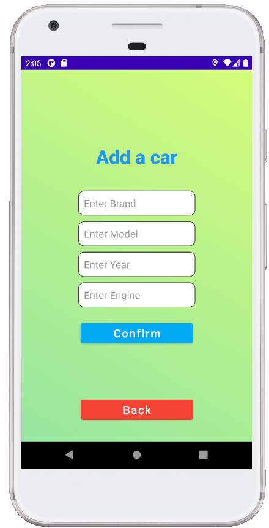
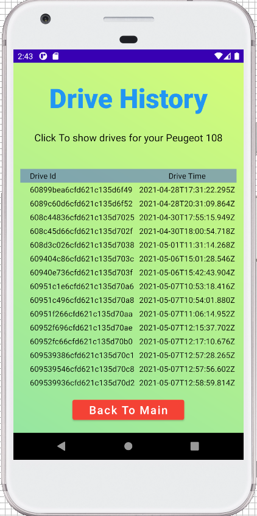

# EE-Drive-Client

<!-- PROJECT LOGO -->
 

  

  <h3 align="center">EE-Drive-Client</h3>

  

    EE-Drive is a driver assist system that helps drivers to reduce their fuel consumption while driving. EE-Drive leverages machine learning techniques to learn the vehicle performance in different environments and locations, and builds an optimal model customized for a vehicle, road, and environmental conditions. The model is then used during a drive to constantly identify the actions the driver should take to optimize vehicle fuel consumption. In this way, the EE-Drive achieves significant reductions in fuel consumption. The principle of this system could be integrated in the future into the car systems themselves such as the cruise control or into an autonomous vehicle.
     
  

<!-- TABLE OF CONTENTS -->

  
<h2 style="display: inline-block">Table of Contents</h2>

  <ol>
    <li>
      <a href="#about-the-project">About The Project</a>
    </li>
    <li>
      <a href="#getting-started">Getting Started</a>
      <ul>
        <li><a href="#register-a-car">Register A Car</a></li>
         <li><a href="#approve-all-permissions">Approve All Permissions</a></li>
      </ul
    </li>
            <li>
      <a href="#use-of-functionalities">Use Of Functionalities</a>
                <ul>
        <li><a href="#choosing-a-car">Choosing a car</a></li>
         <li><a href="#drive">Drive</a></li>
          <li><a href="#model">Model</a></li>
        <li><a href="#car-history">Car History</a></li>
      </ul  
    </li>
  </ol>

<!-- ABOUT THE PROJECT -->

## About The Project

### Client-side responsibilities

- Collect Drive data from OBD and GPS.
- Writing formatted data to json file.
- Send the file to the serve in order to get optimal model for upcoming drive.
- Guiding the user on his upcoming recommended actions during the drive

### Client-side functionalities

- Saves the user’s vehicle model he chose and presents it on the main page.
- Presents the user the car’s information on the main page.
- Saves each finished recording: Hours of drive, road and date.
- While recording, it connects to the OBD2 device of the car, the GPS API and weather API.
- Streams the data to the server.
- Presents to the user the current speed and fuel consumption of the vehicle live.
- Notifies the driver the speed preferred after given a model to the drive from the 

<!-- GETTING STARTED -->

## Getting Started

After installing the app, follow these steps

### Register a car

By entering a brand , model, year, and engine displacement . (These sections are necessary)

 

### Approve all permissions 

Android 10 - Confirm all location and write requests to files. 
    

In Android 11 - confirm the requests, and fasten them in the settings so that the app can write files to the device 
 

   ## Use Of Functionalities 
      
 ### Choosing a car
  Choose your car from the list in the Main screen.Press start to confirm your choice. 
   
  
 ### Drive
Make sure the obd device is working. 
Choose youre OBD device by clicking the bluetooth button, the drive will be start automatically after succsfully connecting and receiving data from the obd . 
  at the end of the drive, press the stop button in order to confirm your drive to the server. 
  Note: if all permissions has been given like requested, the drive file will be created in your storage folder under the path "EE-Drive/Drives".  
   
   
   
   
   ### Model      
 If you are in a model and you check the "Use Model" checkbox. 
You can see on the navbar the current recommended speed . 
Click "Show" to watch it in a larger popUp. 
   
      
      
 
  
  ### Car History
  You can  watch your drive history by clicking the "Drive History" button. 
   

  

See the [open issues](https://github.com/EE-Drive/EE-Drive-Server/issues) for a list of proposed features (and known issues).

ve-Client
